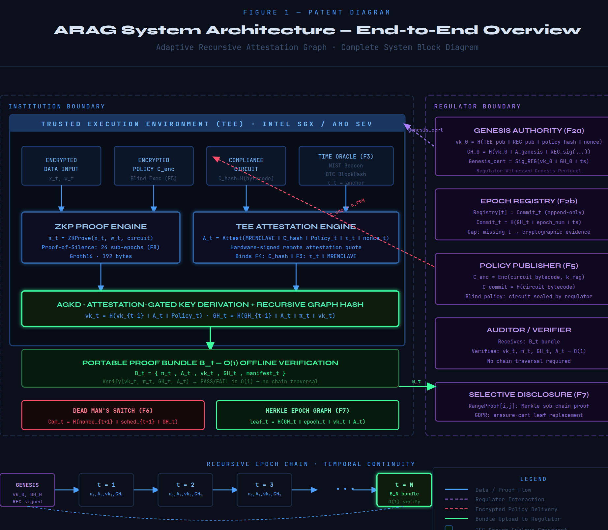
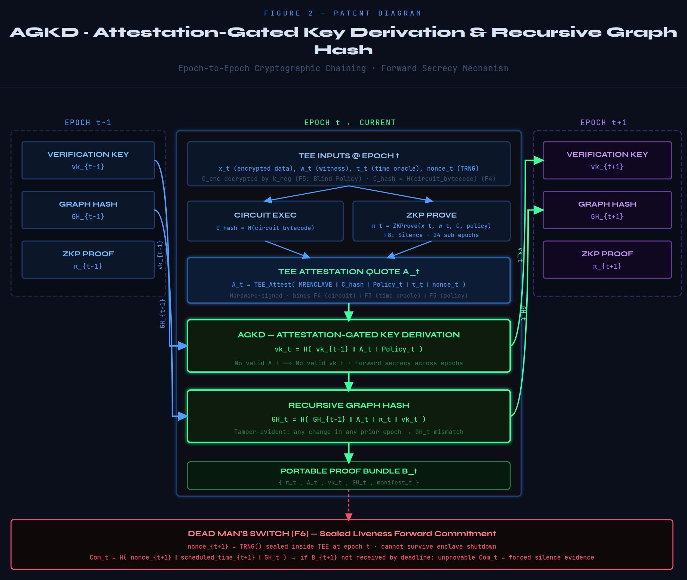
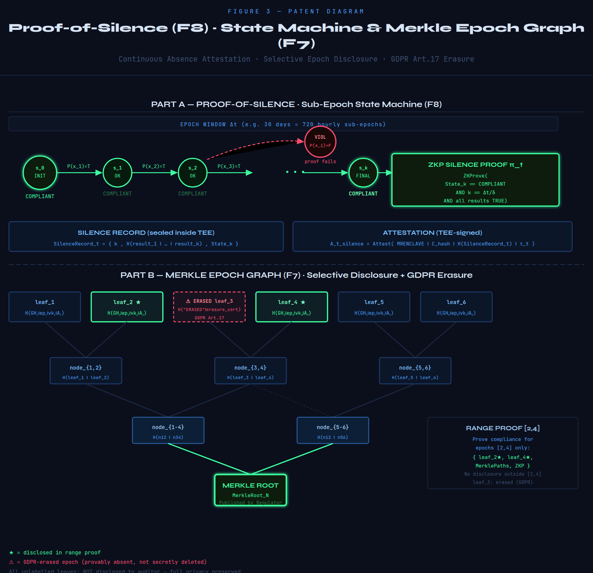

<div align="center">

# ARAG

### Adaptive Recursive Attestation Graph

**Method and System for Generating Enclave-Attested Recursive Zero-Knowledge Proof Graphs for Privacy-Preserving Compliance Verification**

[](#patent)
[](#credits)

**Amritha S** &nbsp;·&nbsp; **Yugeshwaran P**<br>
Supervisor: **Dr. Sritama Roy**, Associate Professor<br>
VIT Chennai — SENSE Department

</div>

---

ARAG lets a bank prove it followed the rules continuously, without revealing any of
its data, and prove that it never broke them at any point in the period covered.

---

## Contents

- [The problem](#the-problem)
- [Why existing tools aren't enough](#why-existing-tools-arent-enough)
- [The idea](#the-idea)
- [Demo videos](#demo-videos)
- [The eight mechanisms](#the-eight-mechanisms)
- [The seven attacks](#the-seven-attacks)
- [Figures](#figures)
- [Running it](#running-it)
- [Architecture](#architecture)
- [Scope — what is real and what is simulated](#scope--what-is-real-and-what-is-simulated)
- [Credits](#credits)

---

## The problem

Banks, crypto exchanges and hedge funds have to prove to a regulator that they
followed the rules. Capital above 8%. Every customer screened against sanctions
lists. Risk limits not breached.

Today they prove it by **handing over the data**. Auditors go through customer
records, positions and balances. Three things are wrong with that:

| | |
|---|---|
| **It exposes data** | Proving you followed a rule shouldn't mean exposing your customers. |
| **It's a snapshot** | An audit says what was true in March, not what was true last Tuesday. |
| **It runs on trust** | Records can be edited before anyone looks at them. |

---

## Why existing tools aren't enough

Three primitives come close. Each one leaves a gap.

| Primitive | What it proves | The gap |
|---|---|---|
| **TEE** — Intel SGX, AMD SEV | Code ran untampered inside a sealed enclave | Proves *an* enclave ran, not **which program** was inside it |
| **ZKP** — Groth16 | A statement is true, revealing nothing | Doesn't prove **real hardware, on real data** produced it |
| **Ledgers** — append-only | A record existed and wasn't altered | Proves what **was written**, never what was **left out** |

---

## The idea

Time is split into **epochs**. In each epoch the institution's enclave checks the
rule against encrypted data, produces a zero-knowledge proof, and has the hardware
sign exactly what it ran. Then that result is hashed together with the *previous*
epoch's hash:

```
GH_t = H( GH_{t-1} ‖ A_t ‖ π_t ‖ vk_t )
```

Every epoch is welded onto the one before it. Change any epoch in the past and
every hash after it stops matching — history becomes un-rewritable.

The verification key is chained the same way, and it is derived **from the
hardware attestation itself**:

```
vk_t = H( vk_{t-1} ‖ A_t.quote ‖ Policy_t )
```

A forged attestation therefore yields a broken key, and a broken key breaks every
epoch that follows. This is **AGKD** — attestation-gated key derivation.

---

## Demo videos

Both videos live in [`demo/`](demo/) and play directly in the browser. Narrated by
Yugeshwaran P.

| Video | Length | Covers |
|---|---|---|
| **[Explainer](demo/ARAG-explained.mp4)** | 6:59 | The problem, why TEE / ZKP / ledgers each fall short, the recursive-chaining idea, one epoch step by step, the seven attacks and their answers, Proof-of-Silence, applications. Includes all three figures. |
| **[Full demo](demo/ARAG-full-demo.mp4)** | 5:18 | The application running: step-mode walk through all eight phases of one epoch, chain growth, O(1) verification, all seven attacks armed and detected one at a time, failure trace, Proof-of-Silence, Merkle range proof, three-institution panel. |

Watch the explainer first. Every hash, proof and detection in the demo is computed
live in the browser — nothing is pre-rendered. See
[Scope](#scope--what-is-real-and-what-is-simulated) for exactly what executes for
real.

[`demo/NARRATION-SCRIPT.md`](demo/NARRATION-SCRIPT.md) holds the full word-for-word
narration, if it ever needs re-recording.

---

## The eight mechanisms

Composing a TEE, a ZKP and a recursive chain creates attack surface that none of
the three has to defend against alone. Each mechanism closes one such gap.

| | Mechanism | Group | What it does |
|---|---|---|---|
| **F1** | Base ARAG architecture | Trust initialization | Attestation, proof and derived key folded into one recursive graph hash |
| **F2a** | Regulator-witnessed genesis | Trust initialization | A chain cannot begin without the regulator's co-signature on `vk_0` |
| **F2b** | Regulator-anchored epoch registry | Trust initialization | Append-only, so a missing epoch is itself proof of deletion |
| **F3** | Verifiable time oracle | Temporal integrity | NIST Beacon + Bitcoin block hash anchor every attestation to real time |
| **F4** | Circuit-level attestation | Execution authenticity | `C_hash = H(circuit)` binds the *program*, not just the enclave |
| **F5** | Blind policy execution | Execution authenticity | The institution proves correct execution of a circuit it cannot read |
| **F6** | Dead man's switch | Continuous compliance | Forced shutdown destroys a sealed nonce — silence becomes evidence |
| **F8** | **Proof-of-Silence** | Continuous compliance | Proves a violation did not occur, across every sub-epoch in the window |

Removing any one of these leaves the composed system exploitable; that
interdependence is the substance of the claim.

### Proof-of-Silence

Every system in the literature proves something *happened* — a transaction, a
block, a signature. ARAG proves something **did not happen**: no violation
occurred at any point in the window, across every sub-epoch in it, rather than at
sampled points.

```
State_k == COMPLIANT  AND  k == Δt/δ  AND  all sub-results TRUE
```

---

## The seven attacks

Every one is implemented and can be armed live in the Attacks panel.

| Attack | Countered by | How it's detected |
|---|---|---|
| Fraudulent genesis | `F2a` | `vk_0` not co-signed by the regulator |
| Time rollback | `F3` | `τ_t` ≠ NIST Beacon round + BTC block |
| Circuit substitution | `F4` | `A_t.C_hash` ≠ `H(registered_circuit)` |
| Missing epoch / gap | `F2b` | Gap in the append-only registry |
| Fake attestation | `F1` / `F4` | MRENCLAVE not in the trusted registry |
| Dead man's switch abort | `F6` | DMS commitment unprovable |
| Tamper previous hash | `F1` | `GH_t` recomputation mismatch |

---

## Figures

<div align="center">

### Figure 1 — System architecture
Institution boundary, regulator boundary, and the recursive epoch chain.



### Figure 2 — AGKD and the recursive graph hash
How one epoch links to the next.



### Figure 3 — Proof-of-Silence and Merkle range proofs
The sub-epoch state machine, and auditing an arbitrary range.



</div>

Interactive versions: [`fig1`](public/diagrams/fig1.html) ·
[`fig2`](public/diagrams/fig2.html) · [`fig3`](public/diagrams/fig3.html)

---

## Running it

```bash
npm install
npm start
# open http://localhost:3000
```

No build step, no bundler. Everything runs natively in the browser.

### What to click

| Section | Try this |
|---|---|
| **Demo** | Turn on **Step Mode**, hit *Generate Epoch*, walk the eight phases |
| **Attacks** | Arm any attack, hit *Generate Epoch*, watch the field-level detection |
| **Verify** | *Load Sample* → *Verify Bundle* — nine checks, constant time |
| **Failure Trace** | *Load Attack Sample* → *Analyze Bundle* for the auditor's view |
| **Multi-Inst** | *Initialize*, run rounds, then arm an attack on one institution only |
| **Silence** | Generate a Proof-of-Silence over the epoch window |

Or press **Auto Demo** on the landing page for a scripted walkthrough.

---

## Architecture

```
├── server.js                     Express static server
├── demo/                         Narrated videos + narration script
├── docs/figures/                 Rendered patent figures
└── public/
    ├── index.html                The app — 12 sections
    ├── diagrams/
    │   ├── fig1.html             System architecture
    │   ├── fig2.html             AGKD block diagram
    │   └── fig3.html             Proof-of-Silence + Merkle
    └── src/
        ├── utils/crypto.js       SHA-256, ZKP sim, TEE attest, Merkle, DMS
        ├── utils/engine.js       ARAG state machine, all 7 attacks
        ├── main.js               UI and all v5 features
        └── styles/main.css       Stylesheet
```

---

## Scope — what is real and what is simulated

This is a **working model of the protocol**, not a production deployment. Being
precise about the boundary:

| Component | Status |
|---|---|
| SHA-256 | **Real** — full implementation in `crypto.js` |
| Recursive graph hash `GH_t` | **Real** — genuinely chained and recomputed on verify |
| AGKD key derivation | **Real** — re-derived independently by the verifier |
| Merkle tree + range proofs | **Real** |
| Attack detection, all seven | **Real** — every check recomputes from the bundle |
| Proof-of-Silence state machine | **Real** |
| Randomness | **Real** — `crypto.getRandomValues` |
| TEE attestation quote | *Simulated* — no SGX/SEV hardware is involved |
| Groth16 prover | *Simulated* — proof fields are hashes; 192 B is the real-world size |
| NIST Beacon + Bitcoin oracle | *Simulated* — derived deterministically, no network calls |

The cryptographic **structure** of the protocol — the chaining, the bindings, the
detection logic — executes exactly as specified. The three simulated components are
stand-ins for hardware and libraries that a production implementation would supply.
The source comments in [`public/src/utils/crypto.js`](public/src/utils/crypto.js)
mark each one.

---

## Patent

Patent pending. Filed via **Khurana & Khurana IP Attorneys**.

## Credits

**Inventors** — Amritha S, Yugeshwaran P
**Supervisor** — Dr. Sritama Roy, Associate Professor
**Institution** — VIT Chennai, SENSE Department

---

<div align="center">
<sub><b>CONFIDENTIAL — ATTORNEY-CLIENT PRIVILEGED WORK PRODUCT</b><br>
Khurana &amp; Khurana IP Attorneys</sub>
</div>
